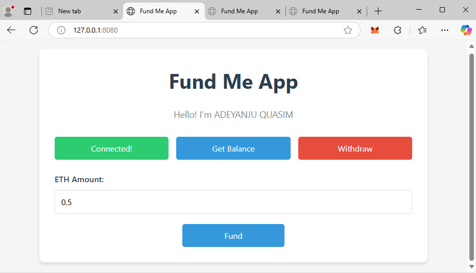

# 💸 Fund Me DApp

A simple decentralized crowdfunding app (DApp) built with **HTML**, **JavaScript**, and **Ethereum smart contracts**. Users can connect their MetaMask wallet, fund a smart contract with ETH, check the balance, and withdraw funds.

---

## 📦 Project Structure

```
├── constants.js              # Contains contract ABI and deployed address
├── ethers-5.2.esm.min.js     # Ethers.js library for interacting with Ethereum
├── index.css                 # Styles for the app UI
├── index.html                # Main frontend structure
├── index.js                  # JavaScript logic (wallet connect, fund, withdraw, etc.)
├── package.json              # Node dependencies (optional for development tools)
├── README.md                 # Project documentation
└── text.txt                  # Placeholder or notes (if needed)
```

---

## 🚀 Features

- ✅ Connect MetaMask wallet
- ✅ Send ETH to the contract (Fund)
- ✅ Withdraw ETH from the contract (Owner only)
- ✅ View contract balance

---

## 🛠️ Tech Stack

- **HTML5 & CSS3**
- **Vanilla JavaScript**
- [**ethers.js**](https://docs.ethers.org/)
- **MetaMask** for Ethereum wallet integration
- Ethereum testnet (e.g., Sepolia or Goerli)

---

## 🧑‍💻 Getting Started

### 1. Clone the Repository

```bash
git clone https://github.com/your-username/fund-me-dapp.git
cd fund-me-dapp
```

### 2. Open `index.html` in Browser

Use VS Code Live Server or just open it directly in Chrome (MetaMask installed).

### 3. Configure Smart Contract

In `constants.js`, replace:

```js
export const abi = [...]; // Your contract ABI
export const contractAddress = "0x..."; // Your deployed contract address
```

---

## 📸 Screenshots

> 

[Click here to download the screenshot](./Screenshot 2025-05-09 222527.png)

---

## ✍️ Author

Adeyanju Quasim

---

## 📬 Contact

- 📧 Email: [quasim132@gmail.com](mailto:quasim132@gmail.com)
- &#x20;Twitter: [@Working_Defi](https://twitter.com/Working_Defi)
- [Discord: quasim_100_17462](https://discord.com/users/quasim_100_17462)
- &#x20;[LinkedIn](https://www.linkedin.com/in/quasim-adeyanju-858753282/)

---
